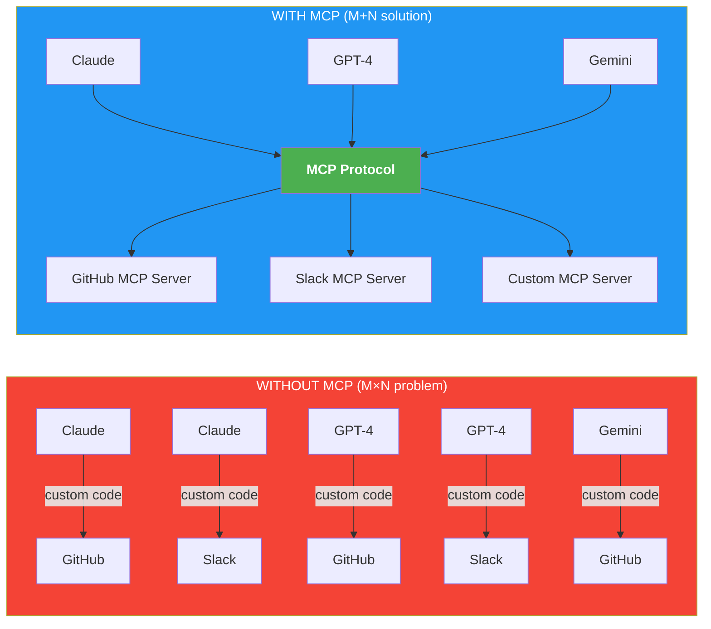
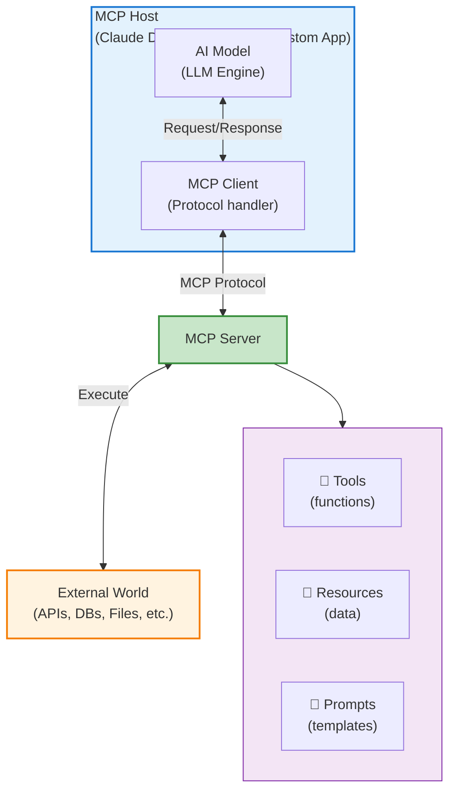

# What is MCP (Model Context Protocol)?

## Overview

**Model Context Protocol (MCP)** is an open-source standard introduced by Anthropic in November 2024. It defines a universal way for AI language models to interact with external tools, data sources, and services.

Before MCP, every AI application needed custom integrations — each model provider had its own proprietary way to call tools. MCP standardizes this so a single server can work with any compatible AI model.

---

## The Problem MCP Solves



---

## Core Architecture



---

## Key Terminology

### MCP Host
The application that embeds/uses AI models — e.g., Claude Desktop, VS Code Copilot, or your custom Python app. The host manages connections to multiple MCP servers.

### MCP Client
Lives inside the host. Manages the lifecycle of MCP server connections, routes requests and responses, and maintains protocol state.

### MCP Server
A lightweight process (written in Python, TypeScript, etc.) that:
- **Exposes Tools** — functions the AI can call (e.g., `search`, `write_file`)
- **Exposes Resources** — data the AI can read (e.g., file contents, DB rows)
- **Exposes Prompts** — prompt templates the user can invoke
- **Requests Sampling** — asks the host LLM to generate text

### Transport Layer
How client and server communicate:
| Transport | Use Case |
|-----------|----------|
| **stdio** | Local subprocess (most common) |
| **SSE** | Server-Sent Events over HTTP (remote) |
| **WebSocket** | Bidirectional streaming (advanced) |

---

## MCP Primitives

### 1. Tools
Functions exposed to the AI that it can **call** autonomously.

```python
@server.tool()
async def get_weather(city: str) -> str:
    """Get current weather for a city."""
    # AI decides when to call this
    return fetch_weather_api(city)
```

### 2. Resources
Data sources the AI can **read** (not execute).

```python
@server.resource("file://{path}")
async def read_file(path: str) -> str:
    """Read a file from the filesystem."""
    return open(path).read()
```

### 3. Prompts
Pre-built prompt templates with arguments.

```python
@server.prompt()
async def code_review(language: str, code: str) -> list[Message]:
    """Generate a code review prompt."""
    return [UserMessage(f"Review this {language} code:\n{code}")]
```

### 4. Sampling
Server can request the host LLM to generate text (powerful for agentic patterns).

---

## Communication Flow

```
User: "What's the weather in Tokyo?"

  1. AI Model decides it needs weather data
  2. MCP Client sends:  tools/call → get_weather(city="Tokyo")
  3. MCP Server fetches weather from API
  4. MCP Server returns: { temperature: "22°C", condition: "Sunny" }
  5. MCP Client delivers result to AI Model
  6. AI Model responds: "The weather in Tokyo is 22°C and sunny."
```

---

## MCP vs. Function Calling vs. RAG

| Feature | MCP | Function Calling | RAG |
|---------|-----|-----------------|-----|
| Standardized | ✅ Universal | ❌ Provider-specific | ❌ Custom per app |
| Real-time data | ✅ Yes | ✅ Yes | ❌ Static at index time |
| Write operations | ✅ Yes | ✅ Yes | ❌ Read-only |
| Multi-model | ✅ Yes | ❌ No | ✅ Yes |
| Server reusability | ✅ One server, many models | ❌ Re-implement per model | ❌ Re-implement per app |

---

## Real-World Use Cases

1. **Development Tools** — Connect Claude to your codebase, run tests, deploy
2. **Data Analysis** — Query databases, generate charts, write reports
3. **Research** — Search the web, read papers, summarize findings
4. **Business Automation** — Read/write CRM, send emails, update tickets
5. **Personal Productivity** — Calendar, notes, file management

---

## Next Steps

- [Installation & Setup →](../02-installation/README.md)
- [Your First MCP Server →](../03-first-mcp-server/README.md)
