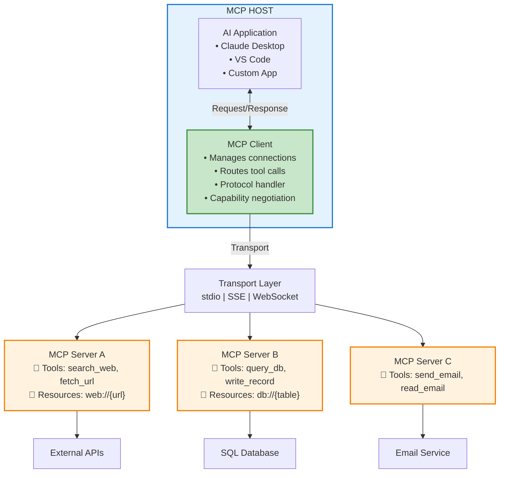
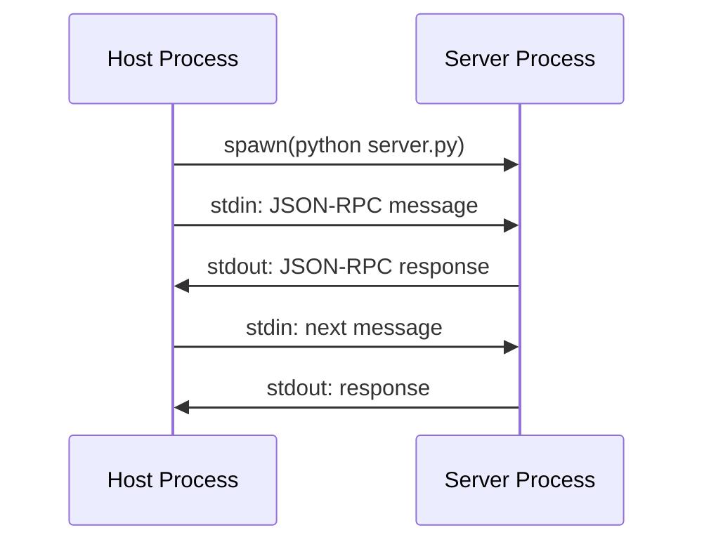
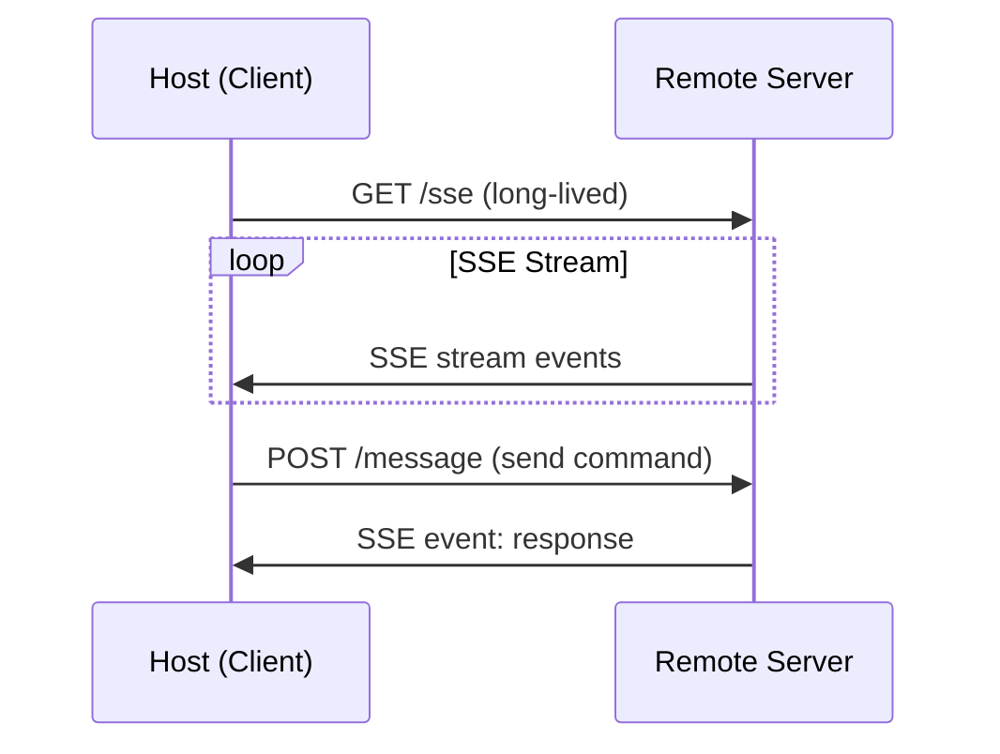
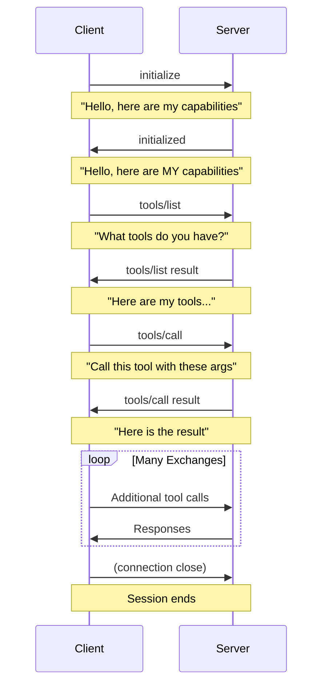
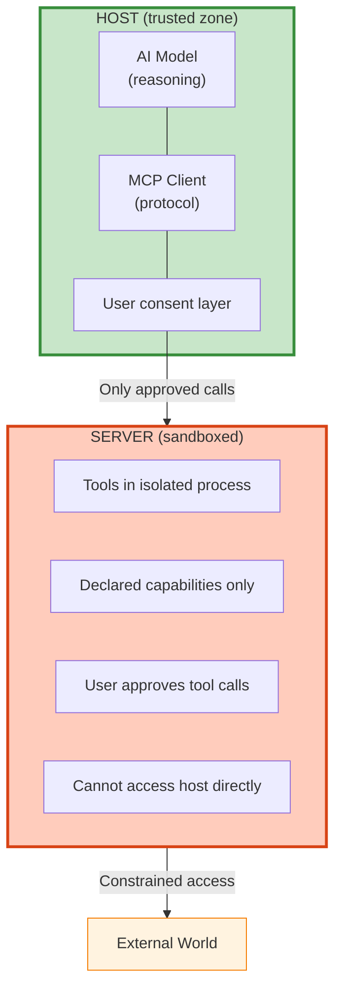

# MCP Architecture

## Overview

Understanding MCP's architecture is key to building robust, scalable AI integrations. This section covers:

1. **Client-Server Model** — How components communicate
2. **Transport Layers** — stdio, SSE, WebSocket
3. **Protocol Messages** — The JSON-RPC 2.0 layer
4. **Lifecycle Management** — Connection and session lifecycle
5. **Security Model** — Trust boundaries and sandboxing

---

## High-Level Architecture



---

## Transport Layers

### 1. stdio (Standard I/O) — Most Common

Used for **local** MCP servers launched as child processes.



**When to use:**
- Local tools (filesystem, databases)
- Claude Desktop / VS Code integrations
- Development and testing
- Security-sensitive operations

```python
# Client connecting via stdio
from mcp.client.stdio import stdio_client
from mcp import StdioServerParameters

params = StdioServerParameters(
    command="python",
    args=["server.py"],
    env={"MY_VAR": "value"},
)
async with stdio_client(params) as (read, write):
    ...
```

### 2. SSE (Server-Sent Events) — Remote Servers

Used for **remote** MCP servers accessible over HTTP.



**When to use:**
- Shared servers in a team
- SaaS tool integrations
- Servers with startup costs (ML models, DB connections)
- Remote services accessed over network

```python
# Client connecting via SSE
from mcp.client.sse import sse_client

async with sse_client("http://localhost:8000/sse") as (read, write):
    ...
```

### 3. WebSocket — Bidirectional Streaming

Full-duplex communication for high-frequency, real-time scenarios.

---

## Protocol: JSON-RPC 2.0

All MCP messages follow the JSON-RPC 2.0 standard:

### Request (Client → Server)
```json
{
  "jsonrpc": "2.0",
  "id": "req-1",
  "method": "tools/call",
  "params": {
    "name": "get_weather",
    "arguments": {
      "city": "Tokyo"
    }
  }
}
```

### Response (Server → Client)
```json
{
  "jsonrpc": "2.0",
  "id": "req-1",
  "result": {
    "content": [
      {
        "type": "text",
        "text": "{\"temperature\": \"22°C\", \"condition\": \"Sunny\"}"
      }
    ]
  }
}
```

### Notification (no response expected)
```json
{
  "jsonrpc": "2.0",
  "method": "notifications/tools/list_changed"
}
```

---

## Connection Lifecycle



---

## Capability Negotiation

During initialization, client and server exchange capabilities:

```python
# Server declares capabilities
server_capabilities = {
    "tools": {"listChanged": True},       # Tools can change dynamically
    "resources": {"subscribe": True},      # Clients can subscribe to changes
    "prompts": {"listChanged": False},     # Prompts are static
    "logging": {},                         # Supports log messages
    "sampling": {},                        # Can request LLM sampling
}
```

---

## Security Architecture



**Key Security Principles:**
1. **Least Privilege** — Servers only get what they need
2. **User Consent** — Sensitive operations require user approval
3. **Process Isolation** — Servers run as separate processes
4. **No Direct LLM Access** — Servers can't control the AI directly
5. **Input Validation** — Always validate inputs at server boundary

---

## Files in This Section

- `client_server_demo.py` — Shows full client-server interaction
- `sse_server.py` — Remote server using SSE transport
- `security_patterns.py` — Secure tool implementation patterns

---

## Next Steps

- [Filesystem Server →](../04-intermediate/01-filesystem-server/README.md)
- [Database Server →](../04-intermediate/02-database-server/README.md)
