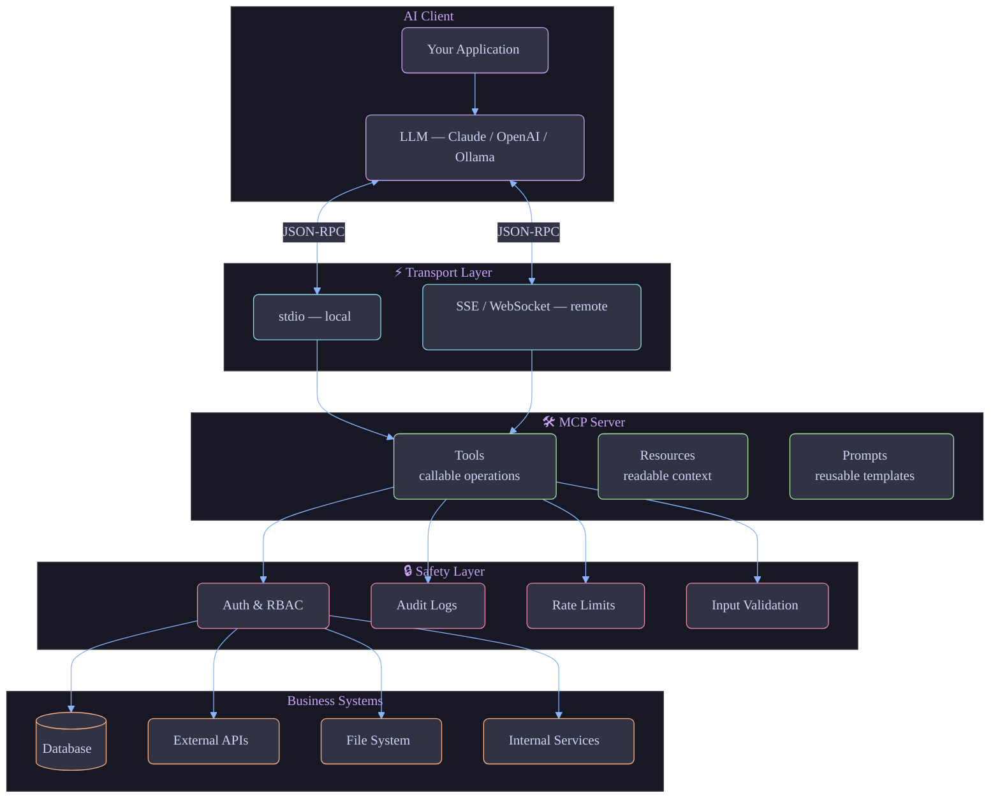

# MCP in Production: A Practical Guide for Engineers Building Real AI Systems

## From local tool-calling demos to secure, governable, production MCP architectures

**Estimated read time: 8 min**

---

Model Context Protocol (MCP) is quickly becoming a foundational integration standard for AI products.

Most teams already know how to build APIs. The challenge now is building a safe, maintainable bridge between LLMs and real systems: databases, internal services, workflows, and external APIs.

That is exactly where MCP shines.

I built this open-source repository to provide a complete, hands-on learning path from basic concepts to production patterns:

**GitHub repo:** https://github.com/wshamim1/mcp-collections

---

## Why MCP Matters Beyond Demos

In many AI projects, teams start with direct integrations:

- raw SQL access from agent code
- broad API keys with little guardrails
- one-off tool wrappers tightly coupled to a single model

These approaches work for prototypes, then collapse under production requirements: security, governance, auditability, and change management.

MCP introduces a cleaner boundary:

- Clients (AI apps) ask for capabilities
- Servers expose explicit, typed operations
- Protocol standardizes interaction across model providers

You stop wiring everything ad hoc and start treating AI-to-system interaction as a proper interface layer.

---

## What I Built

`mcp-collections` is a structured repository designed for progressive learning and practical implementation, mostly in Python.

It covers:

- MCP fundamentals
- Core primitives (tools, resources, prompts)
- Architecture and transport layers (stdio, SSE, WebSocket)
- Real-world servers (filesystem, database, weather API)
- Advanced production patterns (auth, orchestration, logging)
- Multi-model integrations (Claude, OpenAI, Ollama, routing)
- Complete end-to-end examples (data analyst, research assistant, GitHub assistant)
- Human-in-the-loop approval gate pattern (propose → approve → execute)
- Domain starter templates for enterprise workflows (support, CRM, finance ops, DevOps, HR, procurement, compliance, analytics)

This is not a snippet dump. It is an end-to-end learning track.

---

## Architecture in One Mental Model

At a high level:

1. MCP Client runs in or near your AI application.
2. MCP Server publishes capabilities:
   - tools: callable operations
   - resources: readable context/data
   - prompts: reusable templates
3. Transport handles communication:
   - local: stdio
   - remote: SSE / WebSocket
4. JSON-RPC messaging + capability negotiation drive runtime behavior.

The key design benefit: models only interact through declared interfaces, not direct system access.



---

## Real Enterprise Use Case: Private Company Database

A common question I hear: "Can I expose business data to AI without exposing the database itself?"

Yes, and this is one of MCP's strongest use cases.

Instead of giving direct DB access, expose curated tools like:

- `get_customer_summary(customer_id)`
- `list_open_invoices(account_id)`
- `get_sales_dashboard(region, month)`

This gives consumers useful outcomes while preserving control over:

- what operations are allowed
- who can invoke them
- what data leaves the boundary
- how every call is logged and audited

---

## Quick Start (From the Repo)

```bash
git clone https://github.com/wshamim1/mcp-collections.git
cd mcp-collections
python -m venv .venv
source .venv/bin/activate   # Windows: .venv\Scripts\activate
pip install mcp
cd 01-basics/03-first-mcp-server
mcp dev simple_server.py
```

Using `mcp dev` opens MCP Inspector so you can:

- list tools/resources/prompts
- invoke tools interactively
- inspect request/response behavior in real time

This is the fastest way to understand MCP behavior before integrating with a full AI client.

---

## New Additions You Can Try Right Away

Recent updates added practical examples and operational guidance:

- `examples/github-assistant/`: search repos, list issues/PRs, fetch file content
- `examples/customer-support-copilot/`: ticket + knowledge-base workflows
- `examples/sales-crm-assistant/`: leads, opportunity stage updates, tasks
- `examples/finance-ops-assistant/`: invoice policy validation and approvals
- `examples/devops-incident-assistant/`: alerts, log queries, diagnostics
- `examples/hr-self-service-assistant/`: PTO and policy workflows
- `examples/procurement-assistant/`: vendors, purchase requests, budget checks
- `examples/compliance-assistant/`: controls, evidence, audit reports
- `examples/analytics-dashboard-assistant/`: KPI queries and summaries
- `examples/human-in-the-loop-assistant/`: propose, approve, and execute sensitive actions with human review gates
- `examples/data-analyst/`: natural language SQL analysis over SQLite — now with MCP Inspector screenshots showing tool listing and live query execution

I also added a dedicated practical FAQ with production topics:

- deployment options (stdio, SSE, private VPC, gateway, containerized, serverless)
- cost ownership (client vs server vs hybrid LLM costs)
- observability and monitoring (including Langflow-style ecosystem integration)

---

## Production Lessons That Matter

From building and organizing these examples, a few patterns stand out.

### 1. Expose business operations, not generic execution

Avoid "run arbitrary SQL" or "call any URL" endpoints unless heavily sandboxed. Publish narrow, explicit capabilities aligned to business workflows.

### 2. Treat schemas as contracts

Typed inputs/outputs are your stability layer. Version tool contracts as your platform evolves.

### 3. Build authorization at the tool boundary

Authentication alone is not enough. Enforce role- and tenant-aware policy per tool invocation.

### 4. Invest early in observability

At minimum:

- request IDs
- structured logs
- per-tool latency/error metrics
- audit events for privileged actions

### 5. Gate sensitive actions through human approval

For high-risk operations — refunds, production changes, external communications — the human-in-the-loop pattern keeps the model in a "propose only" role until a human explicitly approves. MCP makes this clean: separate tools for `propose_action`, `approve_action`, and `execute_approved_action` enforce the gate at the protocol level, not buried in application logic.

### 6. Design for failure

External dependencies fail. Use timeouts, retries, and circuit breakers where appropriate.

---

## Security Baseline Before Production

Use this as a minimum checklist:

- strong authentication (OAuth/API keys/JWT)
- per-tool authorization
- input validation and sanitization
- parameterized DB queries
- rate limits and timeout limits
- TLS for remote transport
- full audit logs for sensitive operations

MCP helps, but it does not replace engineering discipline.

---

## Who This Repository Is For

- AI engineers building tool-using agents
- backend/platform engineers productionizing LLM features
- teams designing internal AI integration platforms
- developers who want practical MCP examples, not just conceptual docs

---

## Final Thoughts

MCP is not just another tool-calling abstraction. It is an architectural boundary that helps teams scale AI integrations safely.

If your roadmap includes enterprise AI systems, learning MCP now will pay off in cleaner interfaces, lower security risk, and better long-term maintainability.

If useful, check out the repo and start with the first server:

https://github.com/wshamim1/mcp-collections

---

## Suggested Medium Tags

MCP Python AI LLM Software Engineering Architecture


flowchart TD
    subgraph Client["🤖 AI Client"]
        LLM["LLM\n(Claude / OpenAI / Ollama)"]
        App["Your Application"]
    end

    subgraph Transport["⚡ Transport Layer"]
        STDIO["stdio\n(local)"]
        SSE["SSE / WebSocket\n(remote)"]
    end

    subgraph Server["🛠️ MCP Server"]
        Tools["Tools\n(callable operations)"]
        Resources["Resources\n(readable context)"]
        Prompts["Prompts\n(reusable templates)"]
    end

    subgraph Systems["🏢 Business Systems"]
        DB[(Database)]
        API["External APIs"]
        FS["File System"]
        SVC["Internal Services"]
    end

    subgraph Safety["🔒 Safety Layer"]
        Auth["Auth & RBAC"]
        Audit["Audit Logs"]
        RateLimit["Rate Limits"]
        Validation["Input Validation"]
    end

    App --> LLM
    LLM <-->|"JSON-RPC\ncapability negotiation"| STDIO
    LLM <-->|"JSON-RPC\ncapability negotiation"| SSE
    STDIO --> Tools
    SSE --> Tools
    Tools --> Auth
    Auth --> DB
    Auth --> API
    Auth --> FS
    Auth --> SVC
    Tools --> Audit
    Tools --> Validation
    Tools --> RateLimit